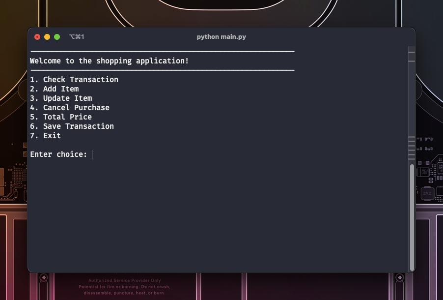

# Shopping Application


## Background
This is a shopping application that allows users to manage their transactions. Users can add items to the transaction, update item details, delete items, view the current transaction, calculate the total price, and save the transaction to a CSV file.

## Structure of the Application
```
.
├── README.md
├── assets
│   ├── code-exploration.ipynb
│   └── header.png
├── helper.py -> helper functions
├── main.py -> main application
└── requirements.txt
```

## Features
### Add Item
```
def add_data(self, item_name: str, item_quantity: int, item_price: int):
    """Add item data to the transaction"""
    try:
        self.df = pd.concat([self.df, pd.DataFrame.from_records([
            {'name': item_name, 'quantity': item_quantity, 'price@quantity': item_price}
        ])], ignore_index=True)
    except:
        return "Error! Please check your input!\n\n"
```
### Update Item
```
def update_item_column(self, item_name: str, column_name: str, value):
    """Update a specific column of an item in the transaction"""
    try:
        self.df.loc[self.df['name'] == item_name, column_name] = value
        return self.df
    except:
        return "Error! Please check your input!"
```
### Delete Item
```
def delete_item(self, item_name: str):
    """Delete an item from the transaction"""
    try:
        self.df.drop(self.df[self.df['name'] == item_name].index, inplace=True)
        return self.df
    except:
        return "Error! Please check your input!"
```
### View Transaction
```
def check_order(self):
    """Display the current transaction"""
    try:
        return self.df
    except:
        return "Error!"
```
### Calculate Total Price
```
def total_price(self):
    """Calculate and display the total price of the transaction"""
    try:
        total_price = sum(self.df['quantity'] * self.df['price@quantity'])
        if total_price > 500_000:
            total_price *= .90
        elif total_price > 300_000:
            total_price *= .92
        elif total_price > 200_000:
            total_price *= .95
        return total_price
    except:
        return "Error!"
```
### Save Transaction
```
def save_transaction(self):
    """Save the transaction to a CSV file"""
    try:
        self.df.to_csv(f'{self.buyer_name}.csv', index=False)
        return self.df
    except:
        return "Error!"
```

## Requirements
### Functional Requirements
To use this application, the following requirements need to be met:
1. Python 3.x
2. Pandas library
3. Clear screen functionality (OS dependent)
### Run the Application
To run the application, run the following command in the terminal:
1. Using Pyenv-Virtualenv, run the following command:
```
pyenv virtualenv <py-ver-installed> shopping-app
```
you can check the Python version installed by running the following command:
```
pyenv versions
```
2. Activate the virtual environment by running the following command:
```
pyenv activate shopping-app
```
3. Install the required packages by running the following command:
```
pip install -r requirements.txt
```
4. Run the application by running the following command:
```
python main.py
```

## Future Improvements
1. Use a database to store the transactions
2. Add a user management functionality